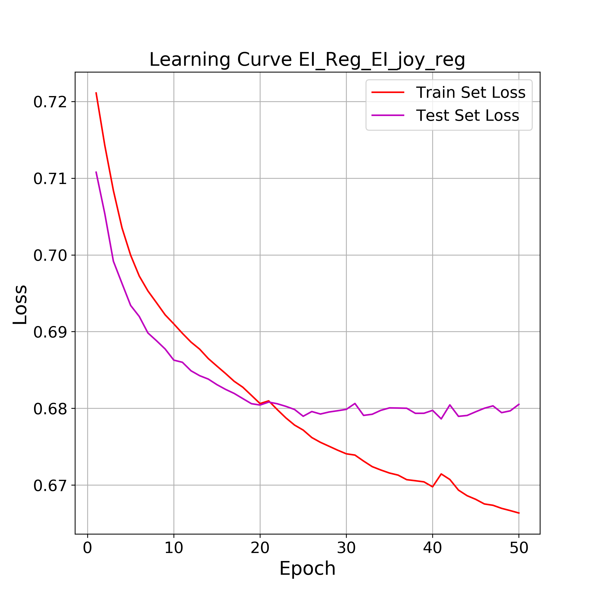

# NLP
This repository containts code for the lab exercises of the NLP cource @ NTUA. 

The course introduces traditional natural language processing tools and concepts such as Finite State Transducers, Hidden Markov Models , N-grams, embeddings, signal based approach to speech recognition and synthesis.  

Authored by [nikitas-theo](https://github.com/nikitas-theo) and [dorotheaKal](https://github.com/DorotheaKal) 

## Lab 1 : Introduction to Language Representations

 We experiment with a weighted minimun distance orthographer built on Finite State Tansducers (FSTs) with the [OpenFST](http://www.openfst.org/twiki/bin/view/FST/WebHome) library. The language model was trained on a corpus of publicly available books. We decided that the best approach is one based on word-level representations, as Unigram or Bigram models reduce accuracy. On the small dataset we experimented on we achieved an accuracy of 0.618.

 For the second part we worked on the  classical IMDB review dataset for classification. Different semantic representations were used:
* Locally trained word2vec embeddings
* GoogleNews embeddings
* tf-idf weighted embeddings

We visualize the proposed corrected words for  *cit*  as input 

## Lab 2 : Speech Recognition with the Kaldi Toolkit

A word/phoneme recognition system is implemented with [Kaldi](https://kaldi-asr.org/), a framework used for state of the art speech applications. 

The features used were the Mel-Frequency Cepstral Coefficients (MFCCs) from 4 speakers (2 male, 2 female), on the USC-TIMIT dataset. The MFCCs are computed as a tansformation of the STFT after τhe Mel Filterbank, desinged to model the logarithmic nature of human sound perception,  is applied. A final DCT transfrom ensures feature independence. More on the MFCCs on [this](https://haythamfayek.com/2016/04/21/speech-processing-for-machine-learning.html) blog.

For the a priori probabilities we used language models, trained on transcription information. The accoustic model is a triphone-based HMM, to include speech context information. The final estimation is Bayesian formulated. The prior probability for a word W, is given by the language model. The likelihood P(X|W) is calculated from the accoustic model (HMM).

The diagram below corrseponds to the typical ASR (Automatic Speech Recognition) system we implemented. 

## Lab 3 : Sentiment Classification with DNNs

We implement Deep Neural Network models for text processing and classification. The PyTorch framework was used.
The task is emotion recognition. GloVe Twitter word embeddings (27B tokens, 50d) were used to exploit the emotion sensitive information in tweets e.g. emojis. 

We used 2 datasets:
* Sentence Polarity Dataset [Pang and Lee, 2005] containing 5331 positive
and 5331 negative movie reviews from Rotten Tomatoes, for binary-classification
(positive, negative).

* Semeval 2017 Task4-A [Rosenthal et al.,2017]. This dataset contains tweets representing 3 classes (positive, negative,neutral) with 49570
training samples and 12284 test (validation) samples.

We experimented with a variety of model  with 2 baseline architectures, a DNN and an LSTM approach. We used different intermediate representations based on word embeddings, such as max and mean pooling and tf-idf. We also implemented an Attention layer on both models.

We visualize the attention layer results of our LSTM model on insightful samples from the test set using [NeAt (Neural Attention) Vision](https://github.com/cbaziotis/neat-vision). 

* Our model correctly predicts **positive** label

* Our model incorrectly labels as **negative** the **neutral** tweet

* Correctrly **positive** labeled

Finally we applied Transfer Learning from the SemEval-2017 Task4-A with target dataset the SemEval-2018 Task1, affect in tweets. We focused on the Emotion Intensity task (EI Regression) for 4 different emotions (joy,anger,sadness,fear). Our implementaion is based on [Baziotis et al., 2018]. The approach gave good results and we showcase the Learning curve for **joy** after training for 50 epochs. 

